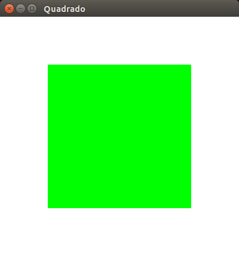

# Trabalho Prático 0 - Ambiente de Desenvolvimento

Você, como um assíduo e responsável programador, vai preparar o ninho de
produção intelecto-científica que tem em casa (vulgarmente chamado
computador) para poder começar a escrever deliciosos programas em OpenGL.

## O que deve ser feito

Em particular, você deve **configurar um ambiente de desenvolvimento** em
linguagem C/C++ de forma que seja possível **compilar e executar programas
que usam OpenGL**.

Esse ambiente é composto por:

- Um **sistema operacional** dentre: Windows, Linux e OSX
- Um **editor de texto** ou
  <abbr title="Integrated Development Environment">**IDE**</abbr>. Exemplos:
  CodeBlocks, Dev-C++, Eclipse, Visual Studio, XCode, Sublime Text

O OpenGL tipicamente já está "instalado" no computador - ele faz parte do
_driver_ da placa de vídeo. Contudo, vamos precisar de outras bibliotecas,
sendo elas:

- **freeglut** (_Free OpenGL Utilities Toolkit_), para poder criar janelas e desenhar usando comandos do OpenGL dentro delas
- **glew** (_OpenGL Extension Wrangler_), para gerenciar qual versão do OpenGL deseja-se usar

## Testando o ambiente

Para testar se o ambiente está funcionando, você deve usar o
programa quadrado.c. Siga os passos:

1. Baixar o [código fonte](https://raw.githubusercontent.com/fegemo/cefet-cg-exemplos-opengl/master/quadrado/main.c)
1. Criar um projeto e configurá-lo devidamente
1. **Modificar o título** da janela para **mostrar o seu nome**
1. Compilar e executar

O programa deve compilar e executar corretamente, gerando o seguinte resultado:

## O que deve ser entregue

Você deve entregar uma imagem contendo uma _screenshot_ da tela do
computador mostrando o programa executando (com seu nome no
título da janela) e o ambiente de desenvolvimento no fundo.

### Pontuação e item extra

Configurar o ambiente e enviar a _screenshot_ vale 1 ponto. Contudo,
você pode também **criar um tutorial descrevendo os passos da
configuração** para ajudar os alunos do futuro. O tutorial vale
**1** delicioso e importante **ponto extra**.

### Envio do trabalho

Envie a imagem com a _screenshot_ pelo [Moodle](http://moodle.cefetmg.br).

Envie o tutorial pelo [Sistema de Tutoriais OpenGL](http://opengl.meteor.com). Não deixe de fazer login no sistema antes.

## Referências de apoio

Veja os tutoriais criados pelos alunos de Computação Gráfica em semestres anteriores:

- Sistema [Tutoriais OpenGL](http://opengl.meteor.com)

Note que ainda não há tutoriais ensinando a instalar o **glew**, pois 2016/01 é o primeiro semestre em que vamos utilizá-lo na disciplina.
