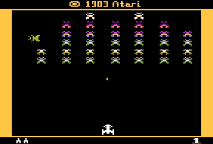

# Trabalho Prático 1 - Galaxian

Neste primeiro trabalho prático vamos experimentar programação orientada a
eventos usando OpenGL. Para isso, vamos implementar um _video game_ simples.

Um dos primeiros jogos que surgiu se chamava Galaxian. Nele, o jogador pilota
uma nave que fica na parte de baixo da tela e, com ela, se defende de um ataque
alienígena. Os alienígenas realizam o seu ataque como uma grande esquadra que
se movimenta lateralmente na parte superior da tela. Os diversos alienígenas
podem soltar bombas contra a heróica nave e, de tempos em tempos, saem da
formação e mergulham individualmente ou em pequenas esquadrilhas num ataque
mais agressivo contra o defensor solitário que, por sua vez, também se
movimenta lateralmente esquivando-se das bombas e disparando mísseis contras os
invasores alienígenas.

A figura é um _screenshot_ do Galaxian original. Na configuração básica
do trabalho, vamos modificar e resumir um pouco o jogo. Primeiramente, o jogo
terá um fim. Se o jogador elimina todos os alienígenas, ele é declarado
vencedor. Porém, se algum alienígena conseguir chegar ao solo, então ele ativa
sua arma secreta mutante e será o vencedor (_game over_). A interface original
do jogo era feita com 3 botões, sendo um para lançar os mísseis (apenas 1 míssil
 por vez na tela), e os outros dois para movimentar a nave defensora para a
esquerda e direita. Vamos mudar essa interface de forma que a movimentação da
nave é  controlada pelo mouse. A posição dele na tela indica a velocidade da
nave defensora, ou seja, o mouse na lateral esquerda da tela significa a nave
mover para a esquerda com velocidade máxima, enquanto que o mouse na lateral
direita indica velocidade máxima para a direita. O mouse centralizado (e pode
se criar um _"dead zone"_ para o mouse, uma região que seria considerada região
neutra) indica a nave parada na tela. A medida que o mouse se desloca para a
direita e para a esquerda a nave defensora acelera na mesma direção. O disparo
dos mísseis pode ser realizado pressionando o botão esquerdo do mouse.

Além disso, ainda na funcionalidade básica, o jogo deve interpretar o
pressionamento da tecla R como comando para reiniciar o jogo, e a tecla ESC
para terminar o programa. O botão direito do mouse deve colocar o jogo em
pausa, deixando o mesmo congelado até que o botão direito seja novamente
pressionado. Esse conjunto de funcionalidades básica vale 70% da nota deste
trabalho.

Para se obter o restante dos pontos do trabalho (ou até mesmo mais pontos
extras) funcionalidades adicionais podem/devem ser implementadas no jogo. Essas
funcionalidades serão avaliadas conforme a dificuldade da implementação, o
efeito obtido com ela no jogo, e a qualidade da implementação. Exemplos de
funcionalidades extras com suas respectivas pontuações:

1. Implementação de múltiplas fases no jogo, com aumento progressivo na
dificuldade. O jogo pode até ficar infinito. **(5-10%)**
1. Várias cenas do jogo: _splash_, menu inicial, cena de jogo, cena de vitória,
_game over_ **(5-10%)**
1. Implementação de múltiplas chances (ou vidas) para o defensor .**(5%)**
1. O gráficos podem ser feitos com texturas, inclusive texturas do jogo
original **(5%)**
1. Os objetos gráficos podem ser animados, ou seja, a apresentação deles varia
com o tempo - por exemplo, as naves podem explodir ao morrer **(5-10%)**
1. O alienígena pode iniciar uma manobra de ataque, opcionalmente em conjunto
com outros alienígenas ao seu redor e descer na tela em direção ao jogador
fazendo uma série de ataques mortais. Se ele chegar no canto inferior da tela,
ele deve reaparecer no canto superior e retornar a seu lugar na esquadra
**(10%)**
1. Os alienígenas podem, ao invés de lançarem apenas bombas, deixar cair
segredos industriais que podem ser usados para melhorar características da
nave, por exemplo: vida extra, escudo defletor, míssil de proximidade
explosivo, entre outros (use sua criatividade). **(10-15%)**
1. Colocar um mecanismo de pontuação do jogador e colocar um placar na tela.
Cada nave que a defensora destrói pode valer mais ou menos pontos dependendo da
nave e das circunstâncias. **(5%)**
1. Qualquer outra idéia que torne o jogo melhor ou mais bonito, como por
exemplo, colocar sons, fazer explosões mais bem elaboradas ou colocar estrelas
coloridas no fundo da tela, como era feito no jogo original. Essas idéias
precisam ser documentadas e explicadas no documento de entrega do trabalho
(README) **(5-10%)**

O trabalho é individual. Deve ser entregue um arquivo .tar.gz ou .zip via
Moodle contendo todo o programa fonte, com os _Makefiles_ e bibliotecas
necessárias para a compilação do programa. Nesse pacote **deve haver também um
arquivo README** com uma descrição da sua implementação, e as **instruções para
a compilação e a execução** do seu jogo.

Qualquer dúvida, entre em contato comigo. Ou acrescente a sua interpretação no
arquivo README e mãos a obra.
