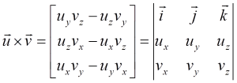
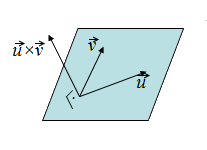
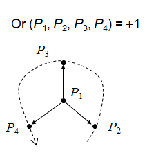
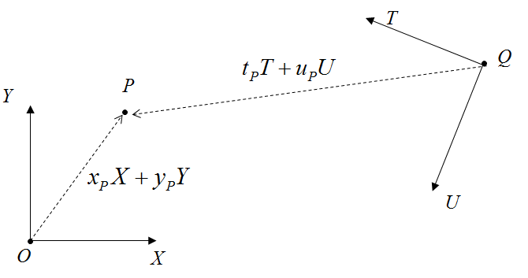
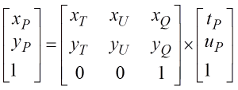
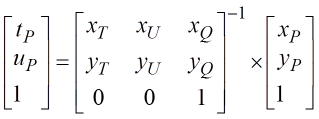

# Geometria - Exercícios

---
# Roteiro

1. Produto Vetorial
1. Orientação
1. Mudança de Sistema de coordenadas
1. Exercícios

---
# Produto Vetorial

---
## Produto Vetorial

- Da geometria Euclidiana, permite achar um vetor perpendicular a outros dois
- Útil na construção de sistemas de coordenadas

  
  

---
## Produto Vetorial (cont.)

- Propriedades (assume-se u, v linearmente independentes):
  - Antisimetria: u \times v = -v \times u
  - Bilinearidade:
    - u \times (\alpha v) = \alpha (u \times v)  e
    - u \times (v + w) = (u \times v) + (u \times w)
  - u \times v é perpendicular tanto a u quanto a v
  - O comprimento de u \times v é igual a área do paralelogramo definido por  u e v, isto é, | u \times v | = | u | | v | \sin \theta

---
# Orientação

---
## Orientação

- Orientação de 2 pontos em 1D
  - P1 < P2 , P1 = P2 ou P1 > P2
- Orientação de 3 pontos em 2D
  - O percurso P1 , P2 , P3  é feito no sentido dos ponteiros do relógio, no
    sentido contrário ou são colineares

    

---
## Orientação

- Orientação de 4 pontos em 3D
  - O percurso P1 , P2 , P3 , P4  está definido segundo a regra da mão direita,
    mão esquerda ou são coplanares

    

---
## Computando a orientação

- A orientação de n+1 pontos em um espaço n-dimensional é dado pelo **sinal
  do determinante da matriz** cujas colunas são as coordenadas homogêneas
  dos pontos **com o 1 vindo primeiro**

  

---
# Mudança de Sistema de Coordenadas

---
## Sistema de Coordenadas (**revisão**)

- Um sistema de coordenadas para R^n é definido por um ponto (origem) e n vetores
- Por exmplo: Seja um sistema de coordenadas para R^2 definido pelo ponto O e
  os vetores X e Y. Então,
  - Um ponto P é dado por coordenadas x_P e y_P tais que

    
P = x_P . X + y_P . Y + O

  - Um vetor V é dado por coordenadas x_V e y_V tais que

    
V = x_V . X + y_V . Y

---
## Mudança de Sistema

- Se estabelecemos um outro sistema (ex.: Q/T/U), como computar as coordenadas
  nesse novo sistema?

  

---
## Mudança de Sistema (cont.)

- Como computar as coordenadas de um ponto P = (x_P, y_P) em O/X/Y dadas as
  coordenadas de P em Q/T/U, isto é, (t_P, u_P)?

  1. Defina P como um ponto no sistema Q/T/U
  1. Defina as componentes do sistema Q/T/U no sistema O/X/Y
  1. Fatore a fórmula de forma a isolar as componentes de O/X/Y
  1. Você achou P = (x_P, y_P) :)

---
## Algebricamente...

- Logo,

  

---
## Mudança de Sistema (cont.)

- Matricialmente:

  
- Usando coordenadas homogêneas:

  

---
## Mudança de Sistema (cont.)

- Para resolver o problema inverso:

  

---
# Referências

1. Lições 6 e 7 das anotações do prof. David Mount
