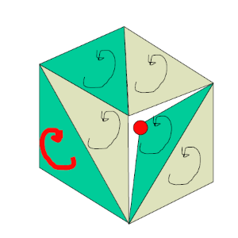
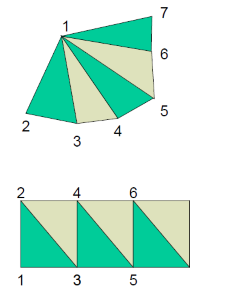

# Modelagem de Objetos

---
# Objetivos

1. Parar de desenhar retângulos :)
1. Conhecer algumas formas para a representação de objetos complexos
1. Refletir sobre melhores formatos para armazenamento de objetos e para sua
   renderização

---
# Motivação

---
## Um arquivo .obj

1. Vamos instalar o **programa "Obj Model Viewer"**
1. **Abrir um modelo** descrito em um arquivo `.obj`
1. Após visualizar o modelo, vamos **abrir** o arquivo `.obj` **usando um
   editor de texto** e entender o que está acontencendo ali

---
## Histórico

- Modelagem por arames (_wireframes_)
  - 
    Representa os objetos por arestas e pontos sobre a sua superfície
  - Gera **modelos ambíguos**
  - Ainda é usado como uma forma barata para visualização (mas não para
    representação)

---
## Histórico

- Modelagem por **superfícies** (década de 60)
  - Fornece a descrição matemática das superfícies que delimitam o objeto
  - Poucos testes de integridade do modelo
- Modelagem de **sólidos** (década de 70)
  - Implícita ou explicitamente contém informações do fechamento e
    conectividade dos objetos
  - Garante a realização física
  - Sistemas <abbr title="Computer Aided Design">CAD</abbr>-<abbr title="Computer Aided Manufacture">CAM</abbr>
    utilizados pela indústria

---
## Paradigmas de Abstração

- Paradigma dos universos
  - Físico F
  - Matemático M
  - Representação R
  - Implementação I

---
<!--
backdrop: paradigma-universos
-->

## Do mundo físico (real) ao mundo matemático

---
<!--
backdrop: paradigma-universos
-->

## Paradigma dos Universos

- FÍSICO
  - Contém **objetos do mundo real** que pretendemos estudar
- MATEMÁTICO
  - Contém uma **descrição abstrata** dos objetos do mundo físico
- REPRESENTAÇÃO
  - Constituído por **representações simbólicas e finitas** associadas a objetos do universo matemático
- IMPLEMENTAÇÃO
  - Associamos às descrições simbólicas e finitas do universo de representação com **estrutura de dados**, com a finalidade de se obter uma representação do objeto no computador

---
<!--
backdrop: paradigma-universos
-->

## Problemas da Área

- Estudar fenômenos em F
- Estudar as relações entre R e M
- Definir representações de modelos em M
- Estudar conversões entre representações R
- Definir métodos de implementação I
- Comparar estratégias em I

---
<!--
backdrop: paradigma-universos
-->

# Representação
---
## Tipos de Representação

- Pontos
- Curvas
- **Superfícies e Sólidos**
  - Um sólido é uma superfície que é (ou tenta ser) fechada
- Volumes
  - Exemplo: Cubo
    - Superfície = 6 quadriláteros (0,0,0)(0,0,1)(0,1,1)…
    - Volume = espaço interno 0 <= x,y,z < 1

---
## Descrição dos Sólidos

- Assuma que um **sólido é um conjunto tridimensional de pontos**
- Conjuntos de pontos podem ser descritos
  - Por suas fronteiras (superfícies)
  - Por composição de sólidos mais simples
  - Por um conjunto de escalares
    - Definidos por equações
    - Amostrados
- Originam três tipos de representação:
  - Por bordo ou fronteira (B-rep – _Boundary Representation_)
  - Operações de conjuntos (CSG – _Constructive Solid Geometry_)
  - Por particionamento do espaço (_BSP-trees_, _Octrees_, etc.)

---
## Representação Linear por Partes

- 
  Superfície parametrizada com geometria complexa pode ser aproximada por uma
  superfície linear por partes
- Pode-se particionar o domínio da parametrização por um conjunto de polígonos
  - Tipicamente **usamos triângulos** (todos os vértices no mesmo plano)
  - Os triângulos formam um **lado de dentro e um de fora**
  - Devemos **usar uma orientação consistente**: _e.g._, sempre CW ou sempre CCW
- Abordagens: (a) sopa de polígonos e (b) malha poligonal

---
## Sopa de Polígonos

- 
  Organização aleatória (caos)
- Não estruturado (`GL_TRIANGLES`)
  – A única ordem garantida é de lado de dentro/fora
- Não contém informação sobre a conectividade dos triângulos
- Muita informação (vértices) redundantes

---
## Problemas da Sopa de Polígonos

- 
  Vantagens:
  - Fácil
- Problemas
  - Redundância
  - Sem conectividade
  - Difícil editar/transformar
  - Risco de _cracking_

---
## Malhas Poligonais

- Gera uma malha poligonal, definida por um conjunto de vértices, arestas e
  faces
  - Cada aresta é compartilhada por no máximo duas faces
  - A interseção de duas faces é uma aresta, um vértice ou vazia
- Adjacência de vértices, arestas e faces é chamada de **topologia** da superfície

---
## Malhas Uniformes

- 
  _grids_, _fans_, _strips_
  - Conectividade é implícita
  - Muito eficiente
  - Processamento fácil
  - Evita transformações redundantes

---
## Decomposição Poligonal

---
## Operações sobre Malhas Poligonais

- 
  **Desenhar a malha** (óbviozão)
- Achar todas as arestas que incidem em um vértice
- Achar as faces que incidem numa aresta ou vértice
- Achar as arestas na fronteira de uma face

---
# Codificação

---
## Tipos de Codificação

- Explícita
- Ponteiros para lista de vértices
- Ponteiros para lista de arestas
- Winged-Edge (Half-Edge, Face-Edge)
- Quad-Edge (Guibas-Stolfi)
- Radial-Edge

---
## Codificação Explícita

- A **mais simples**
- Cada face armazena explicitamente a lista ordenada das coordenadas dos seus
  vértices:

  
- Muita redundância de informação
- Consultas são complicadas
  - Obriga a execução de algoritmos geométricos para determinar adjacências

---
## Ponteiros para Lista de Vértices

- Vértices são armazenados separadamente
- Há uma lista de vértices
- Faces referenciam seus vértices através de ponteiros
- Proporciona maior economia de memória
- Achar adjacências ainda é complicado
- Arestas ainda são desenhadas duas vezes

---
## Exemplo de **Ponteiros para Lista de Vértices**

- V = { V1 = (x1, y1, z1), V2 = (x2, y2, z2), V3 = (x3, y3, z3), V4 = (x4, y4, z4) }
- P1 = { V1, V2, V4 }
- P2 = { V4, V2, V3 }

---
## Ponteiros para Lista de Arestas

- Há também uma lista de arestas
- Faces referenciam as suas arestas através de ponteiros
- Arestas são desenhadas percorrendo-se a lista de arestas
- Introduzem-se referências para as duas faces que compartilham uma aresta
  - Facilita a determinação das duas faces incidentes na aresta

---
## Exemplo de **Ponteiros para Lista de Arestas**

- V = { V1 = (x1, y1, z1), V2 = (x2, y2, z2), V3 = (x3, y3, z3), V4 = (x4, y4, z4) }
- 
  E1 = { V1, V2, P1, &lambda; }
- E2 = { V2, V3, P2, &lambda; }
- E3 = { V3, V4, P2, &lambda; }
- E4 = { V2, V4, P1, P2 }
- E5 = { V4, V1, P1, &lambda; }
- P1 = { E1, E4, E5 }
- P2 = { E2, E3, E4 }

---
## _Winged-Edge_ (Aresta Alada)

---
## _Winged-Edge_ (cont.)

- Criada em 1974 por Baumgart
- Foi um marco na representação por fronteira
- Armazena informação na estrutura associada às arestas (número de campos é fixo)
- Todos os 9 tipos de adjacência entre vértices, arestas e faces são determinados em tempo constante
- Atualizada com o uso de operadores de Euler, que garantem: V – A + F = 2
  - V: número de vértices
  - A: número de arestas
  - F: número de faces

---
## Exemplo

---
## 9 tipos de Relacionamentos de Adjacência

---
# Representação <abbr title="Constructive Solid Geometry">CSG</abbr>

---
## _Constructive Solid Geometry_

- Operações CSG definem objetos através de operações regularizadas de
  conjuntos de pontos
  - União, Interseção e Diferença
- Possibilita uma codificação bastante simples e concisa
- Requer mais computação para renderizar do que _b-rep_

  

---
## Codificação do CSG: Árvore

- 
  Um modelo CSG é codificado por uma árvore
  - Os **nós internos** contêm **operações** de conjunto ou transformações
    lineares afim
  - **Folhas** contêm objetos **primitivos**
    - Cubóides, cilindros, prismas, pirâmides, esferas, cones etc.

---
## Exemplo: SolidWorks

---
## Exemplo _divertido_: o jogo Spore

---
# Representações por Células

---
## Representações por Células

- Dividem o espaço em sub-regiões convexas
  - Grades: Cubos de tamanho igual
  - Octrees: Cubos cujos lados são potências de 2 (1980)
  - BSP-trees: Poliedros convexos
- Às células são atribuídas valores de um campo escalar F(x, y, z)
  - Campo é assumido constante dentro de cada célula
- Sólido é definido como o conjunto de pontos tais que A < F(x, y, z) < B
  para valores A e B estipulados

---
## Grids vs Quadtrees (2D)

- Objeto bidimensional (esquerda), sua representação usando um grid (centro)
  e sua representação usando uma quadtree (direita)

---
## Representação de uma **Quadtree** (2D)

- Neste exemplo, o objeto é formado apenas por um ponto (vinho)

---
## Representação de uma **Quadtree** (2D) - cont.

- 
  Mais um exemplo de quadtree
- Uma **árvore quaternária** pode ser usada para representar uma quadtree
- Apenas os quadrantes que possuem subquadrantes terão nós filhos (i.e.,
  ocuparão espaço na memória)

---
## Octrees

- São úteis para a visualização de objetos que podem ser particionados:
  - 
    Imagens médicas
  - 
    Imagens obtidas por meio de sensores de densidade
- Cada elemeto de um quadrante em um _grid_ é chamado de **voxel**

---
## Voxels

- Um **voxel** representa um valor em um _grid_ tridimensional
  - Pixel = _picture element_; Voxel = _volume element_

---
## Exemplos

---
# Representação Fractal

---
## Fractais

- Benoit Mandelbrot:
  <blockquote>“Clouds are not spheres, mountains are 	not cones, coastlines are not circles and 	bark is not smooth, nor does lightning 	travel in a straight line.”</blockquote>

---
## Fractais... mais nos próximos capítulos

---
# Referências

- Capítulo 13 do livro Computer Graphics with OpenGL, 4th edition
