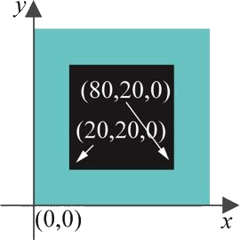
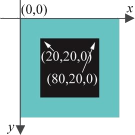
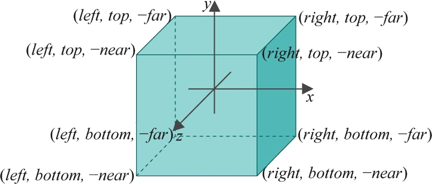
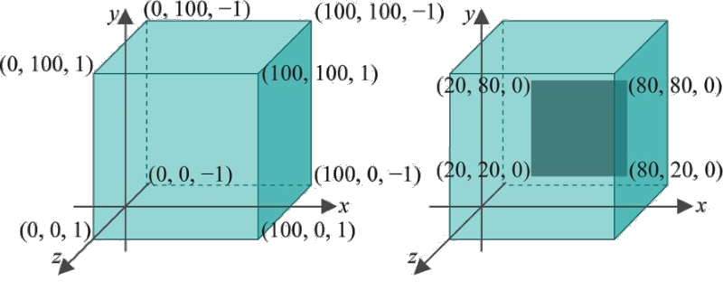
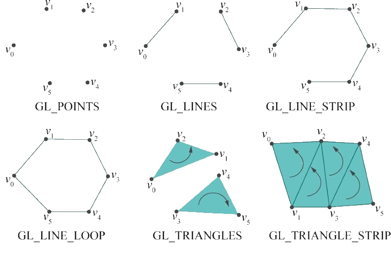
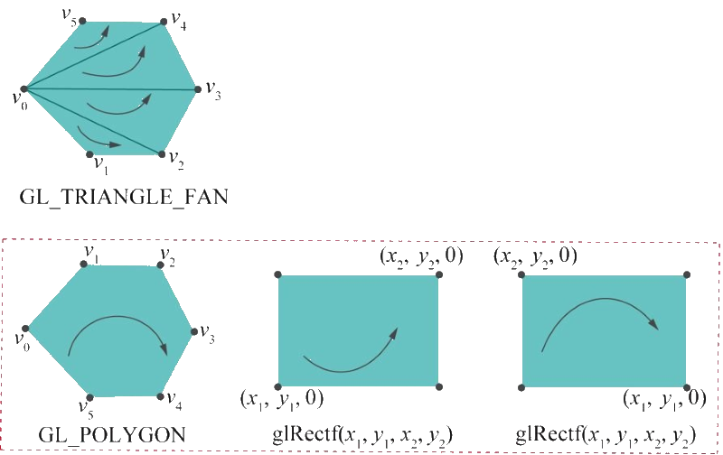

# Introdução a OpenGL **_hands on_**

---
# Roteiro

1. Primeiro programa (_again!_)
1. Sistemas de Coordenadas
1. _Clipping_ (recorte)
1. Cores, Máquina de Estado e Interpolação
1. Primitivas Geométricas
1. Criando uma pequena animação
1. Convenção de nomes do OpenGL
1. Lista de exercícios 1

---
# Primeiro programa


---
## O código fonte, um pouco maior

```c
#include "GL/glew.h"  // use sinal maior,menor
#include "GL/freeglut.h"

// Rotina de desenho
void desenhaMinhaCena()
{
    glClear(GL_COLOR_BUFFER_BIT);
    glColor3f(0.0, 1.0, 0.0);

    // Desenha um polígono por seus vértices
    glBegin(GL_POLYGON);
        // NOVIDADE: antes os valores eram -0.5, 0.5
        glVertex3f(20.0, 20.0, 0.0);
        glVertex3f(80.0, 20.0, 0.0);
        glVertex3f(80.0, 80.0, 0.0);
        glVertex3f(20.0, 80.0, 0.0);
    glEnd();
    glFlush();
}

// NOVIDADE: uma função que vamos chamar dentro
//    do "main"
// Inicia algumas variáveis de estado do OpenGL
void setup()
{
    // define qual é a cor do fundo
    glClearColor(1.0, 1.0, 1.0, 1.0); // branco

    // desenho preenchido vs. contorno
    //glPolygonMode(GL_FRONT_AND_BACK, GL_LINE);
}

// NOVIDADE: callback para o evento "reshape"
void redimensionada(int width, int height)
{
   glViewport(0, 0, width, height);

   glMatrixMode(GL_PROJECTION);
   glLoadIdentity();
   glOrtho(0.0, 100.0, 0.0, 100.0, -1.0, 1.0);

   glMatrixMode(GL_MODELVIEW);
   glLoadIdentity();
}

// NOVIDADE: callback de "keyboard"
void teclaPressionada(unsigned char key, int x, int y)
{
    // vê qual tecla foi pressionada
    switch(key)
    {
    case 27:      // Tecla "ESC"
        exit(0);  // Sai da aplicação
        break;
    default:
        break;
    }
}

// Função principal
int main(int argc, char** argv)
{
   glutInit(&argc, argv);

   glutInitContextVersion(1, 1);
   glutInitContextProfile(GLUT_COMPATIBILITY_PROFILE);

   glutInitDisplayMode(GLUT_SINGLE | GLUT_RGBA);
   glutInitWindowSize(500, 500);
   glutInitWindowPosition(100, 100);

   glutCreateWindow("Quadrado");

   // Registra callbacks para eventos
   glutDisplayFunc(desenhaMinhaCena);
   glutReshapeFunc(redimensionada);  
   glutKeyboardFunc(teclaPressionada);

   // Configura valor inicial de algumas
   // variáveis de estado do OpenGL
   setup();

   glutMainLoop();
   return 0;
}
```

- Exemplo: [quadrado-callbacks](codeblocks:quadrado-callbacks/CodeBlocks/quadrado-callbacks.cbp)

---
## Apenas a função de desenho

```c
void desenhaMinhaCena()
{
    glClear(GL_COLOR_BUFFER_BIT);
    glColor3f(0.0, 1.0, 0.0);

    // Desenha um polígono por seus vértices
    glBegin(GL_POLYGON);
        // NOVIDADE: antes os valores eram -0.5, 0.5
        glVertex3f(20.0, 20.0, 0.0);
        glVertex3f(80.0, 20.0, 0.0);
        glVertex3f(80.0, 80.0, 0.0);
        glVertex3f(20.0, 80.0, 0.0);
    glEnd();
    glFlush();
}
```

---
## Apenas o pedaço que desenha

```c
glBegin(GL_POLYGON);
    // NOVIDADE: antes os valores eram -0.5, 0.5
    glVertex3f(20.0, 20.0, 0.0);
    glVertex3f(80.0, 20.0, 0.0);
    glVertex3f(80.0, 80.0, 0.0);
    glVertex3f(20.0, 80.0, 0.0);
glEnd();
```

---
## glBegin e glEnd

- **Os "cantos" do quadrado** estão especificados por **quatro vértices** entre
  `glBegin` e `glEnd`
- Para **criar um vértice, usamos `glVertex3f`** e passamos as suas coordenadas
  como argumento
- Mas qual é o **sistema de coordenadas** que estamos usando?

---
## Possíveis sistemas de coordenadas




- Começa em cima e na esquerda?
- Começa em baixo e na esquerda?

---
# Projeção Ortogonal, Caixa de Visualização e **Coordenadas do Mundo**

---
## Projeção Ortogonal

- O que os valores das coordenadas dos vértices significam?
  - No vértice (20.0, 20.0, 0.0), 20.0 é em mm., cm. ou pixels?
- Experimento
  - Alterar `glutInitWindowSize()` para os argumentos (300, 300) e depois
  (500, 250)
- Para entender o que as coordenadas representam, precisamos entender o
  mecanismo de renderização do OpenGL
  - Declaração da projeção sendo usada:
    ```c
    //     left, right, bottom, top, near, far
    glOrtho(0.0, 100.0, 0.0, 100.0, -1.0, 1.0);
    ```
    - [Documentação da função `glOrtho`](https://www.opengl.org/sdk/docs/man2/xhtml/glOrtho.xml)

---
## Projeção Ortogonal (cont.)


---
## glOrtho

- ```c
glOrtho(0.0, 100.0, 0.0, 100.0, -1.0, 1.0);
```
- ```c
glOrtho(left, right, bottom, top, near, far);
```
- Documentação do OpenGL 2: https://www.opengl.org/sdk/docs/man2/

---
## glOrtho (cont.)



---
## glOrtho (cont.)

- Forma um cubo com lados alinhados aos eixos
  - esquerda - direita
  - baixo - topo
  - perto - longe
- **Tudo que está dentro é desenhado**, tudo que está fora é descartado

---
## O cubo de Visualização do quadrado.c



 - (esquerda) o cubo de visualização
 - (direita) o quadrado desenhado dentro do cubo

---
## Os 2 Passos para renderização

<h3 class="bullet">Passo 1: **"Fotografar"**</h3>

- Objetos são **projetados perpendicularmente**  na caixa de
  visualização (o _plano próximo_ - _near plane_)
  - No próximo slide, figura (a) para figura (b)

<h3 class="bullet"> Passo 2: **"Revelar"**</h3>

- O **plano de visualização** é escalado ("redimensionado") para
  caber na janela
  - Figura (b) para figura (c)

---
## Passos para renderização (cont.)

<a href="../../images/glortho-render-steps.png">
  
</a>

---
## Sistema de **coordenadas global**

- Ou sistema de coordenadas do mundo
- É o sistema de coordenadas que definimos via `glOrtho` (ou `glFrustum`,
  para projeção perspectiva)
- Tudo o que colocarmos na nossa cena deve ser definido nesse sistema de
  coordenadas
  - Em `quadrado.c`, nossa cena contém apenas os 4 vértices do quadrado

---
## Sistema de coordenadas global (cont.)

- Trocar a caixa de visualização de
  ```c
  glOrtho(0.0, 100.0, 0.0, 100.0, −1.0, 1.0);
  ```
- Para
  ```c
  glOrtho(-100.0, 100.0, -100.0, 100.0, −1.0, 1.0);
  ```
- O que vai acontecer?

---
## Resultado do experimento


---
## Mais experimentos

- Trocar o sistema de coordenadas pelos seguintes valores e testar
  1. ```c
     glOrtho(0.0, 200.0, 0.0, 200.0, −1.0, 1.0)
     ```
  1. ```c
     glOrtho(20.0, 80.0, 20.0, 80.0, −1.0, 1.0)
     ```
  1. ```c
     glOrtho(0.0, 100.0, 0.0, 100.0, −2.0, 5.0)
     ```
- Conclusões:
  1. **Podemos especificar qual é o sistema de coordenadas global**
    com `glOrtho` ou `glFrustum`
  1. A **unidade de medida** dos valores dos vértices é definida
    pelo sistema de coordenadas
    - (20.0, 20.0) não representa pixels!

---
## Sistema de coordenadas **da tela**

- Experimento: Trocar `glutInitWindowSize(500, 500)` por
  `glutInitWindowSize(500, 250)`
  1. Por que o quadrado deixou de ser quadrado?
  1. Como fazer com que ele continue quadrado ao redimensionar?


1. Porque na fase de "impressão", **o conteúdo** da cena "fotografada" foi
  **redimensionado** para que fosse revelado
1. Podemos **fixar a tela de pintura** (_viewport_)
  - ```c
    glViewport(0, 0, 500, 500);
    ```

---
# A Janela do OpenGL e as **Coordenadas da Tela**

---
## Os **Dois Sistemas de Coordenadas**

1. Sistema de coordenadas global (do mundo):
  - Um espaço 3D virtual em que criamos nossas cenas
  - Definido via `glOrtho` e seu irmão `glFrustum`
  - Unidade de medida: arbitrário
1. Sistema de coordenadas da tela (_viewport_):
  - Espaço 2D real onde as imagens "reveladas" são desenhadas
  - Unidade de medida: pixel

---
## **Mapeamento** entre os dois espaços de coordenadas


---
## Experimento

- Alterar as coordenadas `z` de alguns vértices para [-1, 1]
  - Nada acontece visualmente
  - Os vértices continuam dentro da caixa de visualização que definimos via
    `glOrtho`

---
# _Clipping_ (Recorte)

---
## _Clipping_

- Vértices desenhados fora da caixa de visualização são "recortados"
- Experimento
  - Desenhar um novo quadrado com os vértices abaixo
    ```c
     glBegin(GL_POLYGON);
        glVertex3f(120.0, 120.0, 0.0);
        glVertex3f(180.0, 120.0, 0.0);
        glVertex3f(180.0, 180.0, 0.0);
        glVertex3f(120.0, 180.0, 0.0);
     glEnd();
    ```
---
## _Clipping_

- Resultado: o novo quadrado não aparece porque foi _clipped_ - todos seus
  vértices estavam fora da caixa de visualização que definimos no `glOrtho`
- Experimento
  1. Redefinir nossa caixa de visualização para mostrar os dois quadrados
  2. Representar um triângulo, em vez de quadrado, e alterar o valor `z` para
    valores fora da caixa de visualização (-1, -2.5)

---
## Triângulo recortado


---
# Cores, Máquina de Estado e Interpolação

---
## Cores

- A cor do quadrado é definida pelos três parâmetros da função `glColor3f`
  - RGB (vermelho, verde, azul)
- Os valores de cada componente são presos (**_clamped_**) entre 0.0 e 1.0:
  - Se menores que `0`, `0`
  - Se maiores que `1.0`, `1.0`
  - Se entre `0.0` e `1.0`, usa o valor

---
## Valores RGB de algumas cores

- <span class="color-portrait black"> </span> Preto: `glColor3f(0.0, 0.0, 0.0)`
- <span class="color-portrait red"> </span> Vermelho: `glColor3f(1.0, 0.0, 0.0)`
- <span class="color-portrait green"> </span> Verde: `glColor3f(0.0, 1.0, 0.0)`
- <span class="color-portrait blue"> </span> Azul: `glColor3f(0.0, 0.0, 1.0)`
- <span class="color-portrait yellow"> </span> Amarelo: `glColor3f(1.0, 1.0, 0.0)`
- <span class="color-portrait magenta"> </span> Magenta: `glColor3f(1.0, 0.0, 1.0)`
- <span class="color-portrait ciano"> </span> Ciano: `glColor3f(0.0, 1.0, 1.0)`
- <span class="color-portrait gray"> </span> Cinza: `glColor3f(0.6, 0.6, 0.6)`
- <span class="color-portrait white"> </span> Branco: `glColor3f(1.0, 1.0, 1.0)`

---
## OpenGL é uma Máquina de estados

- A função `glColor3f(...)` **altera a cor de pintura CORRENTE**
- Todos os vértices desenhados têm a cor da COR CORRENTE
- A COR CORRENTE muda apenas se chamarmos `glColor3f(...)` novamente
- Este é um modelo de máquina de estados
  - O OpenGL mantém o estado de coisas como cor, grossura das linhas,
    tamanho dos pontos etc.
- Outro exemplo:
  - `glClearColor(...)`, que usamos dentro da nossa função `setup()`, é como **alteramos a cor do fundo**

---
## Experimento com cores

1. Alterar a cor do quadrado
1. Desenhar um quadrado de cada cor
1. Desenhar um quadrado sendo que cada vértice possui uma cor diferente

---
# Primitivas Geométricas

---
## Primitivas Geométricas

- São as construções geométricas que o OpenGL entende
- São os "tijolos" para construirmos objetos complexos
- Exemplos
  1. Pontos (`GL_POINTS`)
  1. Linhas (`GL_LINES`)
  1. Polígonos (`GL_POLYGON`)
- Usamos como um **argumento para `glBegin`**. Por exemplo:
  ```c
  glBegin(GL_POINTS);
      glVertex3f(x, y, z)
      // ...
  glEnd();
  ```

---


---


---
## Do livro vermelho ([online](http://www.glprogramming.com/red/))

| Primitiva         	| Descrição                                                                                                                                                                                                                                                                                                                                                                                                                            	|
|-------------------	|-------------------------------------------------------------------------------------------------------------------------------------------------------------------------------------------------------------------------------------------------------------------------------------------------------------------------------------------------------------------------------------------------------------------------------------------------------------------	|
| GL_POINTS         	| Desenha um ponto para cada vértice n.                                                                                                                                                                                                                                                                                                                                                                                                                             	|
| GL_LINES          	| Desenha uma série de segmentos de linha desconectados. São desenhados entre v0 e v1, v2 e v3, v3 e v4 e daí em diante. Se n é ímar, o último vértice não faz parte de um segmento.                                                                                                                                                                                                                                                                                  	|
| GL_LINE_STRIP     	| Desenha um segmento de v0 a v1, então de v1 a v2 e daí por diante, desenhando o segmento vn-2 para vn-1. Então, um total de n-1 segmentos são desenhados. Nada é desenhado a menos que n seja maior que 1.                                                                                                                                                                                                                                                        	|
| GL_LINE_LOOP      	| Mesmo que GL_LINE_STRIP, exceto que um segmento final é desenhado de vn-1 até v0, completando o circuito.                                                                                                                                                                                                                                                                                                                                                           	|

---
## Do livro vermelho ([online](http://www.glprogramming.com/red/))

| Primitiva         	| Descrição                                                                                                                                                                                                                                                                                                                                                                                                                            	|
|-------------------	|-------------------------------------------------------------------------------------------------------------------------------------------------------------------------------------------------------------------------------------------------------------------------------------------------------------------------------------------------------------------------------------------------------------------------------------------------------------------	|
| GL_TRIANGLES      	| Desenha uma série de triângulos usando os vértices v0, v1, v2, depois v3, v4, v5, e daí por diante. Se n não é um múltiplo de 3, o último ou os 2 últimos vértices são ignorados.                                                                                                                                                                                                                                                                               	|
| GL_TRIANGLE_STRIP 	| Desenha uma série de triângulos usando os vértices v0, v1, v2, depois v2, v1, v3 (repare na ordem), então v2, v3, v4 e daí por diante. A ordem é para assegurar que os triângulos estão todos desenhados com a mesma orientação de forma que a tira possa formar parte de uma superfície corretamente. Preservar a orientação é importante para algumas operações, como _culling_.                                                                                    |
| GL_TRIANGLE_FAN   	| Mesmo que GL_TRIANGLE_STRIP, exceto que os vértices são v0, v1, v2, depois v0, v2, v3, depois v0, v3, v4, e daí por diante.                                                                                                                                                                                                                                                                                                                                         	|

---
## Do livro vermelho ([online](http://www.glprogramming.com/red/))

| Primitiva         	| Descrição                                                                                                                                                                                                                                                                                                                                                                                                                            	|
|-------------------	|-------------------------------------------------------------------------------------------------------------------------------------------------------------------------------------------------------------------------------------------------------------------------------------------------------------------------------------------------------------------------------------------------------------------------------------------------------------------	|
| GL_QUADS          	| Desenha uma série de quadriláteros usando os vértices v0, v1, v2, v3, depois v4, v5, v6, v7, daí por diante. Se n não é múltiplo de 4, os últimos 1, 2 ou 3 vértices são ignorados.                                                                                                                                                                                                                                                                      	 	|
| GL_QUAD_STRIP     	| Desenha uma série de quadrilátores começando com v0, v1, v3, v2, então v2, v3, v5, v4, depois v4, v5, v7, v6 e daí por diante. n deve ser pelo menos 4 antes que algo seja desenhado. Se n é ímpar, o último vértice será ignorado.                                                                                                                                                                                                                               	|
| GL_POLYGON        	| Desenha um polígono usando os pontos v0, ... , vn-1 como vértices. n deve ser pelo menos 3, ou nada é desenhado. Ademais, o polígono especificado não deve se auto-intersectar e deve ser convexo. Se os vértices não satisfazerem essas condições, os resultados não imprevisíveis.                                                                                                                                                                                  |

---
## Experimentos com as primitivas

1. Desenhar pontos (`GL_POINTS`) em vez de quadrados. Para que os
  pontos fiquem visíveis, **aumentar seu tamanho usando `glPointSize()`**.

1. Usar outras primitivas: `GL_LINES, GL_LINE_STRIP, GL_LINE_LOOP`

---
## Preenchimento

- Estávamos desenhando polígonos preenchidos até agora
- Mas podemos estipular que queremos apenas sua silhueta
  ```c
  glPolygonMode( GL_FRONT_AND_BACK, GL_LINE );  // ou GL_FILL
  ```
  - Assinatura da função:
    ```
    glPolygonMode(faces, modo);
    ```
    - `faces`: `GL_FRONT`, `GL_BACK` ou `GL_FRONT_AND_BACK`
    - `modo`: `GL_FILL` (padrão, para preencher) ou `GL_LINE` (contorno)
  - [Documentação do glPolygonMode](https://www.opengl.org/sdk/docs/man2/xhtml/glPolygonMode.xml)

---
## Experimento com tipo de preenchimento

1. Alterar a forma de desenho das primitivas
  ```c
  glPolygonMode( GL_FRONT_AND_BACK, GL_LINE );  //GL_FILL
  ```
  e a primitiva para
  ```c
  glBegin( GL_TRIANGLE_STRIP );
      ...
  ```

---
# Convenção de nomes do OpenGL

---


- Análogo para `glColor`

---
# Lista de exercícios 1

Link via **Moodle**

---
# Referências

- Documentação do OpenGL 2: https://www.opengl.org/sdk/docs/man2/
- Livro Vermelho: http://www.glprogramming.com/red/
