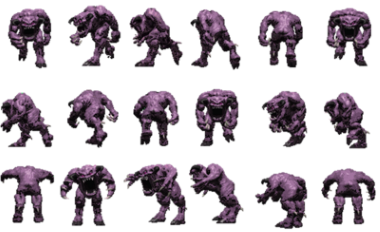
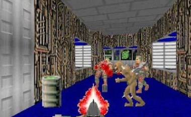
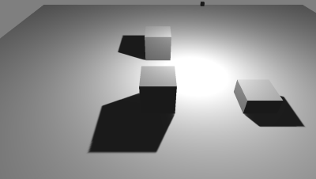
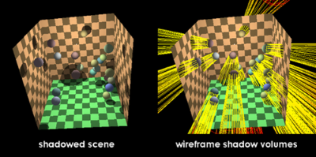
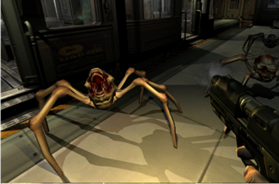
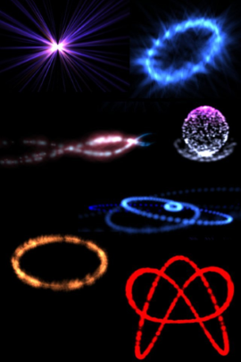
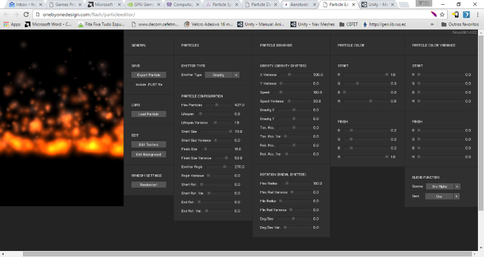
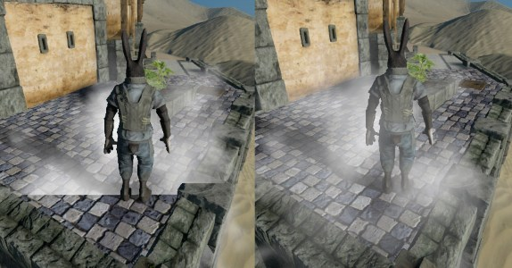
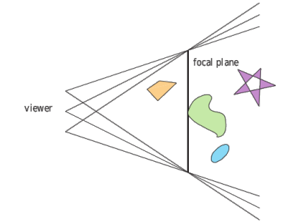

# Efeitos Visuais

---
## O espectro de renderização

_"The **goal of rendering** is to **portray an object on the screen**;
  how we attain that goal is our choice"_
  (Akenine-Möller e amigos)


---
# Objetivos

1. Entender o funcionamento de **_skyboxes_** para maquear a limitação do
  campo de visão
1. Conhecer a técnica de **_billboarding_** e **_spriting_** para
  renderização "barata"
1. Simular o comportamento e aparência de gases e fogo com **sistemas
  de partículas**
1. Conhecer técnicas para geração de **sombras**
1. Conhecer técnicas para simulação de reflexão (espelho, metal etc.)
  usando **_environment mapping_**
1. Conhecer efeitos de câmera **_depth of field_** e **_motion blur_**

---
<!--
backdrop: skybox
-->

# Skybox

---
## _Skybox_

- 
  Para maquear a limitação do campo de visualização, podemos usar um
  _**skybox**_ envolvendo todo o frustum
- Um _skybox_ é tipicamente criando usando um **cubo** cujas faces internas
  recebem texturas que representam o que pode ser visto no **horizonte
  da cena**
  - Mas outros modelos podem ser usados além do cubo
  - O _skybox_ **deve ser mover** juntamente com o **campo de visão**

---
<!--
backdrop: billboarding
-->

# _Sprites_ e _Billboarding_

---
## _Sprites_ e _Billboarding_


- Uma **_sprite_** é uma imagem desenhada diretamente na cena
  - Pode ter os pixels desenhados diretamente, ou a partir de uma textura
    aplicada a um retângulo
  - Animações quadro a quadro podem ser feitas, utilizando mais imagens e
    alterando qual imagem está sendo mostrada
- Um caso especial de _sprite_ é a técnica de **_billboarding_**
  - Neste caso, o polígono texturizado é **orientado de acordo
    com a direção de visualização**
  - Quando a visualização muda, a orientação do polígono muda

---
## _Billboarding_ não é um conceito novo

- Apesar de ser um jogo 3D, todos os inimigos do jogo Doom eram _billboards_




---
## **Orientação** do _Billboard_

1. 
_Screen-aligned_
  - Imagem sempre paralela à tela
  - <span class="math">normal = -view</span>
  - <span class="math">up = camera.up</span>
  - Útil para textos dentro da cena (e.g., etiquetas explicativas), _lens flare_
1. _World-oriented_
  - <span class="math">normal = -view</span>
  - **<span class="math">up = world.up</span>**
  - Usado para objetos não simétricos
1. _Axial_
  - Rotaciona no próprio **eixo da base** com **variação limitada**
  - <span class="math">up = world.up</span>
  - Árvores distantes que tentam ficar de frente pra câmera

---
## _**Screen**-aligned_

- Renderização de anotações explicativas

  <video width="484" height="380" class="left-aligned" poster="../../images/screen-aligned-billboard.jpg" controls>
    <source src="../../videos/screen-aligned-billboard.mp4" type="video/mp4" />
  </video>

---
## _**World**-aligned_

- Renderização de nuvens em tempo real

  

---
## _**World**-aligned_

- Trabalho de [_Harris and Lastra_, 2001](http://www.markmark.net/PDFs/RTClouds_HarrisEG2001.pdf)

  

---
## _**Axis**-aligned_


- Código fonte em
  [codesampler.com](http://www.codesampler.com/oglsrc/oglsrc_8.htm)

---
# Sombras em Tempo Real

---
## **Sombras**

- 
  O uso de sombras a uma cena aumenta o realismo e fornece dicas visuais
  para a profundidade e posição de objetos
- As técnicas mais comuns em _real-time_:
  1. ~~_Hack_ simplão~~
  1. _Shadow volumes_
  1. _Shadow maps_

---
## Sombras (1): **_Hack_ simplão**

- 
  Renderizar cada objeto duas vezes:
  - Primeiro passo: renderizar normalmente
  - Segundo passo: projetar no plano do chão e renderizar totalmente preto
- Pros:
  - Fácil e até convincente
- Cons:
  - Torna-se rapidamente um problema geométrico complexo
    - Fácil projetar em um plano infinito
    - Mas e numa escada? Morro?

---
## Sombras (2): **_Shadow Volumes_**

- A técnica foi proposta em 1977 (Frank Crow), mas popularizada com o jogo
  Doom 3
- 
  Para cada par <luz, objeto>, computar a região da malha que obstrui a luz
  1. Encontrar a silhueta sob a perspectiva da luz
  2. Projetar a silhueta ao longo dos raios da luz (fazer uma extrusão)
  3. Triangular (gerar triângulos) conectando a silhueta e sua projeção para
     obter o **volume da sombra**
- Um ponto <span class="math">P</span> está na sombra da luz
  <span class="math">L</span> se algum volume de sombra contém
  <span class="math">P</span>
- Tipicamente, usa-se o _stencil buffer_ ([Everitt e Kilgard, 2002](http://arxiv.org/ftp/cs/papers/0301/0301002.pdf))

---
## Sombras (2): **_Shadow Volumes_** (1)

- 
  Pros:
  - A sombra é super precisa (a nível de pixel) e não sofre problemas de
    _aliasing_
- Cons:
  - Computacionalmente mais cara que _shadow maps_

---
## Sombras (3): **_Shadow Maps_** (1)

- 
  Renderiza a cena usando **cada fonte de luz como centro de projeção**,
  salvando apenas o _z-buffer_
  - Imagens 2D resultantes são os **mapas de sombras** (uma por fonte de luz)
- Em seguida, renderiza a cena do ponto de vista da câmera

---
## Sombras (3): **_Shadow Maps_** (2)

- 
  Para determinar se ponto <span class="math">P</span> de um objeto está
  na sombra:
  1. Computar a distância <span class="math">d_P</span> de
    <span class="math">P</span> até a fonte de luz
  1. Converter <span class="math">P</span> das coordenadas do mundo para
    coordenadas do _shadow map_ (usando matrizes
    <span class="math">projection * view</span> usada para gerar o mapa)
  1. Recuperar a distância <span class="math">d_{min}</span> no mapa
  1. <span class="math">P</span> está na sombra se
    <span class="math">d_P \leq d_{min}</span>, _i.e._, se estiver atrás de um
    objeto mais próximo da fonte


---
## Sombras (3): **_Shadow Maps_** (3)

- 
  Pros:
  - Pode ser extendida para ter _soft shadows_
  - Mais barata que _shadow volumes_
- Cons:
  - Implementação simples tem problemas seríssimos de _aliasing_
    - Câmera mais próxima da sombra que a fonte, muitos pixels podem ser
      cobertos por apenas um "texel" do _shadow map_
- Há várias técnicas para resolver o problema de _aliasing_...

---
## Sombras (3): **_Shadow Maps_** (4)

- **_Screen Space Blurred Shadow Mapping_**:
  - Sombras renderizadas em uma textura e ela é borrada e então aplicada na tela
- **_Percentage Closer Filtering_**:
  - Usa mais de um "texel" do _shadow map_ para determinar se ponto está na
    sombra


---
<!--
backdrop: particles
-->

# Sistema de partículas

---
<!--
  backdrop: particle-system-fire
-->

## O que é

- Um **sistema de partículas** é um conjunto de objetos pequenos colocados
  em movimento, usando algum algoritmo
- Com ele, é possível simular: **fogo, fumaça, explosões, galáxias giratórias,
  lançamento de magias, efeito de "_level up_"** etc.

---
## Sistemas de Partículas

- 
  **Partículas** são controladas por um **emissor**
  - Ele instancia e finaliza as partículas
  - Também determina suas posições, tamanho etc.
  - Contém um ou mais parâmetros de **comportamento** das partículas, _e.g._:
    - Taxa de nascimento
    - Velocidade inicial
    - Tempo de vida da partícula etc.
- Os valores dos parâmetros das partículas são tipicamente aleatorizados

---
## Sistemas de Partículas: Funcionamento

- Estágio de simulação (`void atualiza()`):
  - Novas partículas são criadas baseado na **taxa de nascimento**
    - Cada parâmetro inicial é definido baseado na **configuração do emissor**
  - Partículas que excederam seu tempo de vida são removidas
  - Para cada partícula viva, seus parâmetros são atualizados
    - Colisão da partícula com o mundo pode ser usado, mas não é comum (é caro)
- Estágio de renderização (`void desenha()`):
  - Partículas são tipicamente renderizadas usando uma **_sprite_ ou
    um _billboard_**
  - Mas também podemos usar `GL_POINTS`, `GL_LINES`

---
## Sistema de Partículas: C/C++

```c
struct Particula
{
  Particula * anterior, * proxima;
  Vetor posicao;
  Vetor direcao;
  int vidaSobrando;
  Vetor cor;
  Vetor deltaCor;
};
```
- [_The Ocean Spray in Your Face_](https://www.lri.fr/~mbl/ENS/IG2/devoir2/files/docs/particles.pdf) -
  um tutorial sobre sistema de partículas simples (1998)

---
## Sistema de Partículas: C/C++ (2)

```c
struct Emissor
{
  // Configuração
  Vetor posicao;
  float angulo, variacaoAngulo;
  float velocidadeTangencial, variacaoVelocidadeTangencial;
  // Lista de partículas
  Particula * primeira;
  int numeroMaximoParticulas;
  int numeroParticulasVivas;
  int taxaEmissaoPorQuadro;
  int vidaMaxima, variacaoVidaMaximo;
  Vetor corInicial, variacaoCorInicial;
  Vetor corFinal, variacaoCorFinal;
  // Física
  Vetor forcaGlobal; // Gravidade, vento etc.
};
```

---
## Exemplo de Editor de SP

[](http://onebyonedesign.com/flash/particleeditor/)

---
## Desafios

- Quando interage com objetos tridimensionais do mundo, podemos ter o (d)efeito
  indesejado de "arestas acentuadas":
  
  - Vídeo mostrando [problema das arestas acentuadas](https://www.youtube.com/watch?v=ES0IY_e5Kd8)
- Para consertar, podemos usar a técnica de **_soft particles_** ao renderizar

---
## Desafios: usando **_soft particles_**

- A ideia é deixar a partícula transparente em suas partes próximas aos objetos
  da cena
  - É possível fazer de forma barata usando o _depth buffer_

<figure style="position: relative; width: 100%; height: 500px">
  
  
  
  
</figure>

---
<!--
backdrop: depth-of-field
-->

# Efeitos de câmera

---
## _Depth of field_


- Simulação do fato que o olho humano mostra com menos nitidez os objetos
  que estão mais distantes do ponto alvo
- Em OpenGL, podemos usar o **_accumulation buffer_**
  - [Como fazer _depth of field_](http://www.glprogramming.com/red/chapter10.html), no livro vermelho
  - [Referência do `glAccum`](https://www.opengl.org/sdk/docs/man2/xhtml/glAccum.xml) na documentação do OpenGL

---
## _Depth of field_ usando _Accumulation Buffer_



- "Tira fotos" deslocando a câmera levemente para cada lado
- Mescla as fotos usando o _accumulation buffer_
- Regiões laterais ficam fora de foco

---
## _Motion blur_


- Simulação de efeito de movimentação muito rápida
- Também pode ser feito usando o **_accumulation buffer_**
  - [Como fazer _motion blur_](http://www.glprogramming.com/red/chapter10.html), no livro vermelho
  - Exemplo:
  ```c
  float q = 0.8f;
  glAccum(GL_MULT, q);
  glAccum(GL_ACCUM, 1-q);
  glAccum(GL_RETURN, 1.0);
  ```

---
# Referências

- Livro _Real-Time Rendering (3<sup>rd</sup> edition)_
  - Capítulo 10: _Image-Based Effects_
- Livro vermelho
  - [Capítulo 10: _The Framebuffer_](http://www.glprogramming.com/red/chapter10.html)
- [_The Ocean Spray in Your Face_](https://www.lri.fr/~mbl/ENS/IG2/devoir2/files/docs/particles.pdf) -
  um tutorial sobre sistema de partículas simples (1998)
- [Post da Wolfire Games](http://blog.wolfire.com/2010/04/Soft-Particles)
  sobre _soft particles_ no jogo Overgrowth
